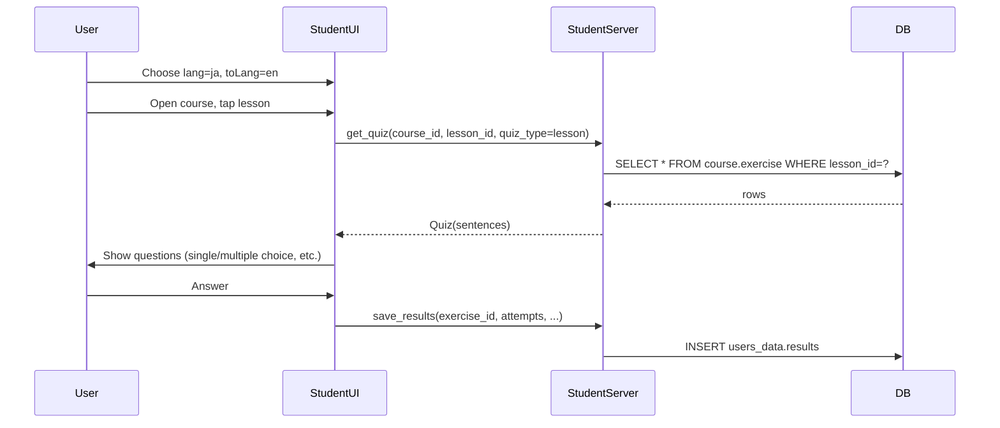

# Student app ready for Japanese course

**Goal:** Use the student app to learn Japanese with your existing Japanese-for-English-speakers course (already in the DB). No changes to Editor or Content in this phase.

**Current state (summary):**

- **Course list and detail:** Implemented. [student/ui](student/ui) fetches courses by `lang`/`to_lang` via [CourseService](student/ui/lib/core/services/course_service.dart), shows [CourseDetailPage](student/ui/lib/features/courses/presentation/pages/course_detail_page.dart) with modules and lessons. Default settings are `spanish`/`arabic` — you need `ja`/`en` (via Settings or default).
- **Quiz:** Backend [quiz router](student/server/src/routers/quiz.py) returns **stub** `Quiz` objects (no real data). Client [quiz_provider](student/ui/lib/shared/providers/quiz_provider.dart) calls `get_quiz` with a **different contract** (practiceId, corpus, etc.) and has no `course_id`/`lesson_id`.
- **Exercises:** Backend [exercise router](student/server/src/routers/exercise.py) queries **content.exercise** with **hardcoded IDs** — wrong schema; your course data is in **course.exercise** ([editor/DDL/excercise.sql](editor/DDL/excercise.sql): id, lesson_id, course_id, module_id, lang, to_lang, exercise_type, sentence, options, to_sentence, to_options, extra_data, audio_link, etc.).
- **Lesson → Quiz:** Course detail shows lessons but **lesson ListTiles have no onTap** — there is no way to "Start lesson" and open the quiz.
- **Results:** Client sends a custom payload (part_id, dialogue_line, …); backend only prints. [users_data.results](common/DDL/users_data/results.sql) expects user_id, course_id, lesson_id, question_id, question_type, result (jsonb).

---

## 1. Backend: Real quiz from course.exercise (student server)

**File:** [student/server/src/routers/quiz.py](student/server/src/routers/quiz.py)

- For `QuizType.lesson`, implement `get_lesson_quiz(req: QuizRequest)`:
  - `SELECT * FROM course.exercise WHERE lesson_id = %s [AND course_id = %s] ORDER BY id`
  - For each row, build a **Sentence** (or equivalent) for the existing [Quiz](student/server/src/models/quiz.py) model:
    - `sentence` / `to_sentence` for display (e.g. show `sentence` in learned language, options from `options`/`to_options`; decide one convention, e.g. sentence = JA, options = EN for ja→en).
    - `options`: list of `{ "option": text, "correct": bool }` — from `options`/`to_options` and/or `extra_data` depending on how the editor stored them (see [create_course_from_file](editor/server/src/generators/create_course_from_file.py), [gen_alphabet_exercise](editor/server/src/generators/gen_alphabet_exercise.py)).
    - `exercise_type` → map to a `question_type` the client already supports (single_choice, multiple_choice, explanation, identify_words, etc. — see [quiz_model.dart](student/ui/lib/shared/models/quiz_model.dart) `QuizQuestionType` and `fromJson`).
    - `sound` from `audio_link`; `sentence_id` = exercise `id` for results.
  - Return `Quiz(lang=..., to_lang=..., course_id=..., lesson_id=..., sentences=[...])`. Add minimal defaults for any fields the client expects (e.g. practiceId, accuracy) so the client does not break.

**File:** [student/server/src/models/quiz.py](student/server/src/models/quiz.py)

- Ensure `Quiz` and `QuizRequest` already have `course_id`, `lesson_id` (they do). Ensure response model matches what the client `Quiz.fromJson` expects (lang, to_lang, sentences; optional practiceId, etc.).

---

## 2. Backend: Exercise router (student server)

**File:** [student/server/src/routers/exercise.py](student/server/src/routers/exercise.py)

- Either **remove** the current hardcoded `content.exercise` query, or **replace** it with a lesson-based endpoint, e.g. `GET /api/v1/exercise?lesson_id=123` that returns exercises from **course.exercise** for that lesson. Prefer the former if the quiz response is self-contained (all data in get_quiz); otherwise a simple "list exercises by lesson_id" can help for future features.

---

## 3. Backend: Save results (student server)

**File:** [student/server/src/routers/results.py](student/server/src/routers/results.py) and [student/server/src/models/results.py](student/server/src/models/results.py)

- Implement `save_results`: accept a payload that includes at least `user_id`, `course_id`, `lesson_id`, `exercise_id` (or question_id), `question_type`, and `attempts`/score (or a small `result` object).
- Insert into `users_data.results` (question_id = exercise_id, question_type, result = json with attempts/score). Align with [common/DDL/users_data/results.sql](common/DDL/users_data/results.sql); if the DDL uses non-Postgres syntax (e.g. auto_increment), the actual DB may already use SERIAL — use a schema that matches your real table.

---

## 4. Client: Request quiz by lesson (student UI)

**Files:** [student/ui/lib/shared/models/quiz_model.dart](student/ui/lib/shared/models/quiz_model.dart), [student/ui/lib/core/services/api_service.dart](student/ui/lib/core/services/api_service.dart), [student/ui/lib/shared/providers/quiz_provider.dart](student/ui/lib/shared/providers/quiz_provider.dart)

- Add to **QuizRequest**: `course_id`, `lesson_id`, and optionally `quiz_type` (e.g. `"lesson"`). Keep existing fields for backward compatibility or for future "practice" modes.
- In **ApiService**, ensure `getQuiz` sends these when provided (backend already has them in [QuizRequest](student/server/src/models/quiz.py)).
- In **QuizNotifier**, add **loadQuizForLesson(courseId, lessonId)** (or extend `loadQuiz`): set lang/toLang from [SettingsState](student/ui/lib/shared/providers/settings_provider.dart) (or from course), build `QuizRequest` with course_id, lesson_id, quiz_type: lesson, and call `ApiService.getQuiz`. Use this when opening a lesson (step 5).

---

## 5. Client: Open quiz from a lesson (student UI)

**File:** [student/ui/lib/features/courses/presentation/pages/course_detail_page.dart](student/ui/lib/features/courses/presentation/pages/course_detail_page.dart)

- For each lesson **ListTile**, add **onTap**: navigate to the existing [QuizPage](student/ui/lib/features/quiz/presentation/pages/quiz_page.dart) with **courseId**, **lessonId**, and course **lang**/**toLang** (and any other needed params: showText, autoPlay, showTransliteration from settings).
- **QuizPage** (and quiz_provider): when courseId/lessonId are provided, call **loadQuizForLesson(courseId, lessonId)** in initState instead of the current generic `loadQuiz()`. Ensure QuizPage receives courseId/lessonId (e.g. via constructor or route args).

---

## 6. Client: API base URL and results URL (student UI)

- **CourseService** and **ApiService** use `BASE_PATH` from `.env` (default `https://polyglots.social`). For **local** use with your Japanese course, point to the **student server** (e.g. `http://localhost:8004` per [docker-compose](docker-compose.yaml)). Document or set in `student/ui/.env`: e.g. `BASE_PATH=http://localhost:8004` (and same host for results).
- In [quiz_provider](student/ui/lib/shared/providers/quiz_provider.dart), **save_results** currently uses a hardcoded `http://localhost:8000`. Change to use the same base URL as ApiService (e.g. from env or a shared config) and the correct path (e.g. `/api/v1/results/save_results`). Align request body with the new backend results model (exercise_id, course_id, lesson_id, attempts, etc.).

---

## 7. Settings: Japanese for English (student UI)

- Default in [settings_provider](student/ui/lib/shared/providers/settings_provider.dart) is `spanish`/`arabic`. For your immediate use, either (a) set default to `ja`/`en`, or (b) ensure the Settings UI lets you choose **Japanese** (ja) and **English** (en) so that the course list shows "Japanese for English speakers" and quiz requests use lang=ja, to_lang=en. Option (b) is better for multi-language support.

---

## 8. Optional: Progress and auth

- **Progress:** ITERATIONS and ROADMAP describe a simple progress indicator (e.g. lessons done, words/sentences). Can be deferred until "lesson → quiz" works.
- **Auth:** Currently commented out in [main.py](student/server/src/main.py). You can keep it off until you need multi-device or cloud sync.

---

## Data flow (target)

---

## Order of work (suggested)

1. **Backend get_quiz** — Implement lesson quiz from course.exercise and map exercise_type → question_type so the client can render existing question types.
2. **Client loadQuizForLesson + QuizRequest** — Add course_id/lesson_id to request and a dedicated load-for-lesson path.
3. **Course detail → Quiz** — Lesson onTap → navigate to QuizPage with courseId/lessonId; QuizPage uses loadQuizForLesson.
4. **Env / base URL** — Point student UI to student server (e.g. 8004) and fix results URL.
5. **Settings** — Ensure ja/en can be selected (or set as default for your testing).
6. **Results** — Implement save_results and wire client payload to it; fix quiz_provider save URL and body.
7. **Exercise router** — Remove or replace hardcoded content.exercise query.

After this, you can open the app, select Japanese → English, open your course, tap a lesson, and run a real quiz from the DB. Refinements (progress, auth, more question types, audio) can follow in later iterations.
